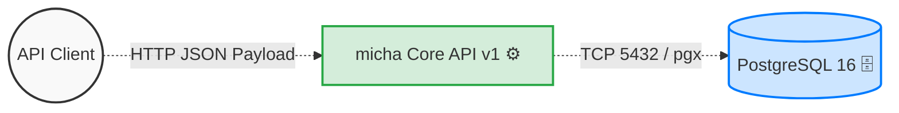
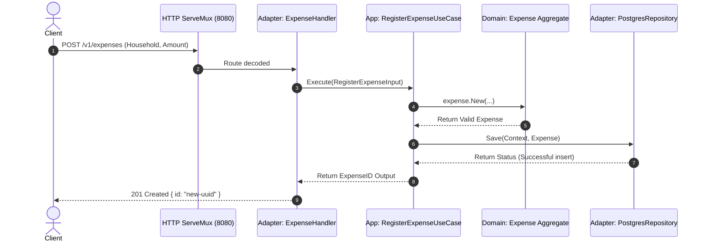
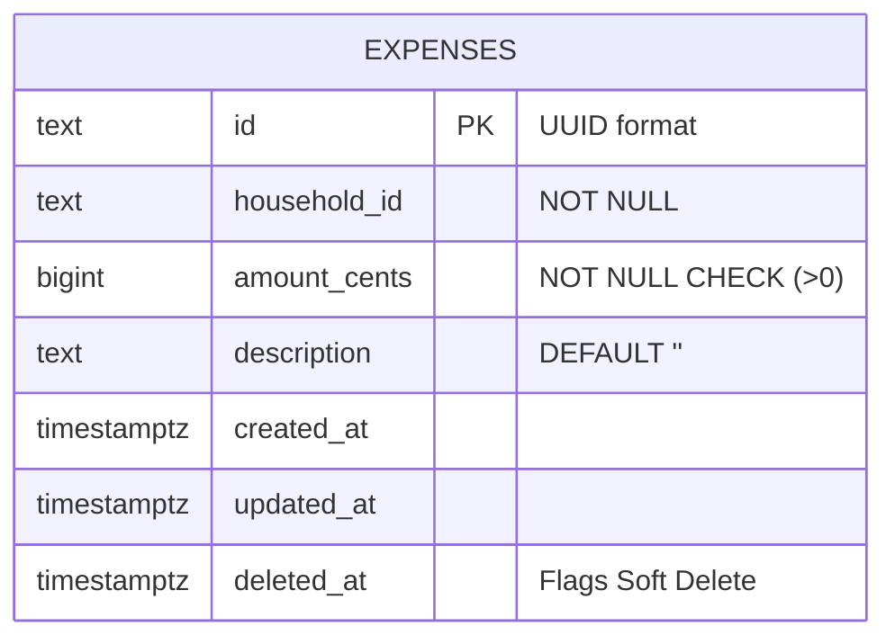
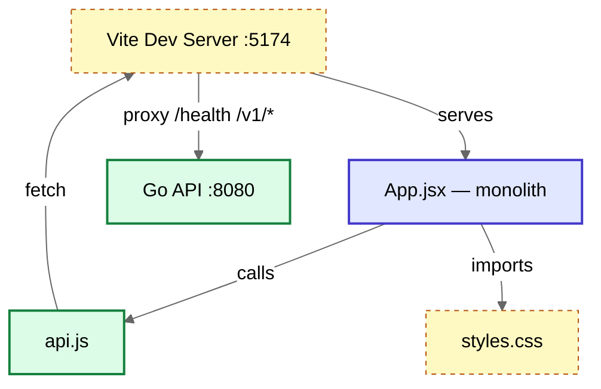
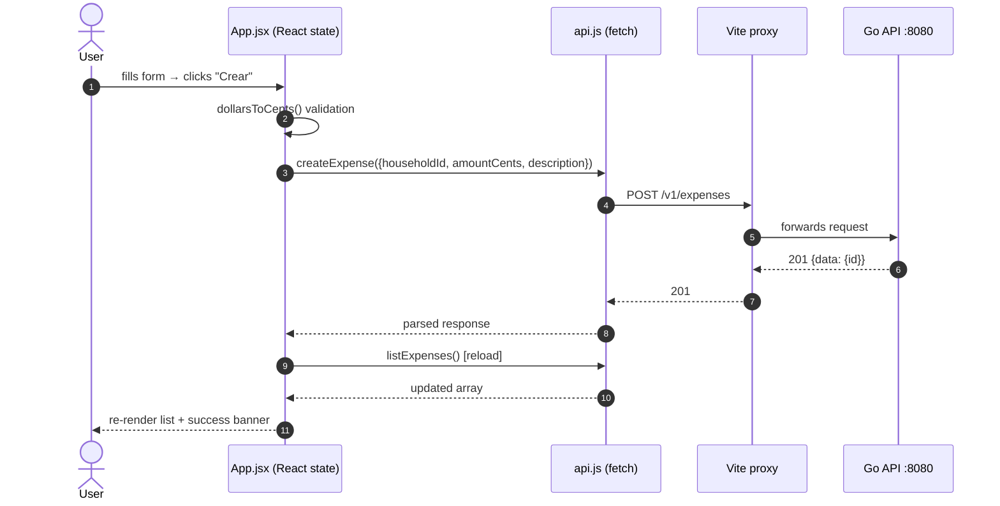
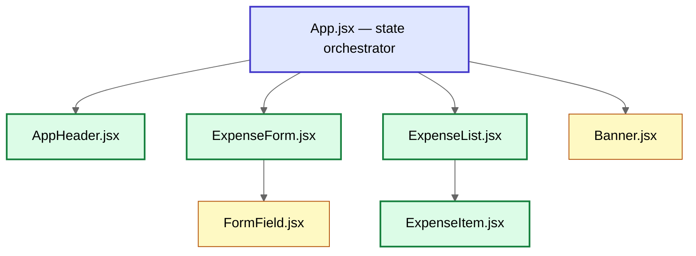

# 🏛️ Archæological Report: `micha` Backend

> **Date of Excavation:** March 1, 2026
> **Archaeologist:** Code Archeologist Agent (ArchæoRepo Pro)
> **Target:** `backend/`

## 📌 Executive Summary
**Project Paradigm:** Backend HTTP Monolith using Domain-Driven Design (DDD) with Strict Clean/Hexagonal Architecture boundaries.  
**Target Stack:** Go 1.24, PostgreSQL 16 (via `pgxpool`), Standard Library Mux Routing.  

The backend system is highly organized and meticulously divided into distinct layers (`domain`, `application`, `adapters`, `infrastructure`, `ports`). It implements a complete, production-ready vertical slice for **Expense Management**. Heavy reliance on standard libraries guarantees minimal external bloat. State is persisted in PostgreSQL without any ORM, employing direct optimized SQL statements and soft-deletion strategies.

---

## 🔎 Phase 1: Reconnaissance (Architecture & Structure)

### Directory Mapping
The internal module is modeled after strict DDD principles:
*   `cmd/api/main.go` — The Composition Root where the dependencies are wired (Dependency Injection) and the server boots.
*   `internal/adapters/` — Holds the `http` layer serving the handlers, and the `postgres` persistence layer (`expense_repository.go`).
*   `internal/application/expense/` — Encapsulates workflow use cases: `Register`, `Get`, `Patch`, `Delete`, and `List`.
*   `internal/domain/expense/` — The Aggregate Root of our context. Pure Go code implementing invariants, business rules, and behavior (`Expense`).
*   `internal/infrastructure/` — Hosts configuration loading logic.
*   `migrations/` — Contains pure SQL layout for application setup.

### Context Diagram


**Node Glossary:**
*   **API Client**: User/Frontend interacting with the REST HTTP interface.
*   **micha Core API**: The compiled application natively handling `8080`.
*   **PostgreSQL 16**: Containerized data store maintaining persistence state.

---

## ⛏️ Phase 2: Deep Excavation (Data Flow & Integrations)

### The Thread of Ariadne (Tracking an Expense Request)
The data flow systematically pushes dependencies _inward_ (`adapter` → `application` → `domain`):
1.  **Transport (Adapter)**: `httpadapter.Server` registers standard library `ServeMux` routes for HTTP actions.
2.  **Controller (Adapter)**: The request maps to an `ExpenseHandlerDeps` component inside `expense_handler.go`, effectively bridging JSON decoding to the execution method of an incoming payload.
3.  **Use Cases (Application)**: Application objects (`RegisterExpenseUseCase`) orchestrate fetching required data or instantiating domain models (`idGenerator.NewID()`).
4.  **Aggregate Validation (Domain)**: `expense.New()` handles invariants such as rejecting negative/zero monetary inputs (`shared.ErrInvalidMoney`).
5.  **Persistence (Adapter/Outbound Port)**: Valid entities communicate with `postgres.ExpenseRepository` where `pgx` serializes via standard `INSERT` or updates using mapped attributes.

### Live Core Functionalities (Ready & Functional)
The application has successfully wired a full API resource for `expenses`:
*   `GET /health` : Verifies system status.
*   `POST /v1/expenses` : Creates a new Expense. Requires positive non-zero amounts.
*   `GET /v1/expenses/{id}` : Retrieves a Single Expense (Handles Soft Delete awareness).
*   `GET /v1/expenses` : Retrieves non-deleted Expenses ordered by creation desc, filtered by `household_id`.
*   `PATCH /v1/expenses/{id}` : Partially alters attributes, updating `updated_at`.
*   `DELETE /v1/expenses/{id}` : Updates an `Expense` model flagging `deleted_at`, mapping to a physical `UPDATE` SQL operation.

### Request Lifecycle Sequence (POST)



**Node Glossary:**
*   **HTTP Router**: Golang `net/http` router acting as entry point.
*   **Adapter Layer**: Infrastructure layers interpreting raw JSON (Handler) and SQL query executions (Postgres Repo).
*   **App / Domain Layer**: Absolute center logic without any side effects natively built in memory.

### Persistence Layer Topology



---

## ⚕️ Phase 3: Entropy Analysis (Health)

### Infrastructure Integrity
*   **Health Score: 9/10** — The codebase is heavily optimized, adhering rigorously to hexagonal constraints. Test files exist natively across domains. Logging (`log/slog`) and structured errors are implemented across the core operations. Outstanding test separation and isolation.

### Dense Coupling Points
*   `cmd/api/main.go`: The system is manually orchestrating Dependency Injection (DI) entirely inside the top-level composition root. While technically a dense coupling block, it aligns perfectly with the DI paradigm preventing implicit magic frameworks.

### Code Debt / Strict Rule Deviations [⚠️ Speculative]
*   **Architectural Document Misalignment**: As per `docs/adr/0001-adopt-ddd-clean-hexagonal.md` and `.github/copilot-instructions.md`, inbound use-case contracts and infrastructure contracts *should* reside in `internal/ports/inbound` and `internal/ports/outbound`. 
    *   **Reality**: Folders `internal/ports/inbound` and `outbound` are currently **empty**. Contracts (such as `ExpenseRepository`, `RegisterExpenseInput`, etc.) are actually defined within `internal/application/expense/contracts.go`.

### Dark Zones [💀 Possible Missing Elements]
*   **Access Control**: Despite listing and fetching by `household_id`, there is no evidence of an Authentication/Authorization layer. The JSON payload relies on client truthfulness rather than validated identities/JWT headers. Any authorized or unauthorized actor can perform mutations via `/v1/expenses`.
*   **Database Migrations Engine**: The `migrations/001_create_expenses.sql` script relies on a developer or infrastructure CI pipeline to manually run `psql -f`. There is no automated go-based migration (such as `golang-migrate`) executed by the app or container on boot.

---

## 🖼️ Phase 5: Frontend Excavation

### Stack Snapshot

| Concern | Technology |
|---|---|
| Language | JavaScript (ESM) |
| Framework | React 18 |
| Build tool | Vite 5 |
| Styling | Vanilla CSS (no framework) |
| HTTP | Fetch API (browser-native) |
| Proxy | Vite `server.proxy` → `localhost:8080` |

### Directory Map
```
frontend/
  src/
    App.jsx       ← monolithic component (all state + all UI)
    api.js        ← fetch wrappers for every backend endpoint
    styles.css    ← flat utility/component CSS, no design tokens
    main.jsx      ← React 18 root mount
  index.html
  vite.config.js
```

### Container Diagram



**Node Glossary:** `App.jsx` owns all state and renders every section inline; `api.js` wraps `fetch` for each endpoint; Vite proxies API calls to go avoid CORS.

### Frontend Request Lifecycle



### Frontend Tech Debt [⚠️]

| # | Issue | Location | Severity |
|---|---|---|---|
| 1 | All state + all UI in one 294-line component | `App.jsx` | High |
| 2 | Amount input accepts raw cents (UX unfriendly) | `App.jsx` | Medium |
| 3 | No CSS design tokens (magic hex values everywhere) | `styles.css` | Medium |
| 4 | No sub-components — zero reusability | `frontend/src/` | High |
| 5 | Spanish UI copy mixed into code | `App.jsx` | Low |
| 6 | No `aria-label` / `role` on interactive elements | `App.jsx` | Medium |

### Recommended Component Tree


